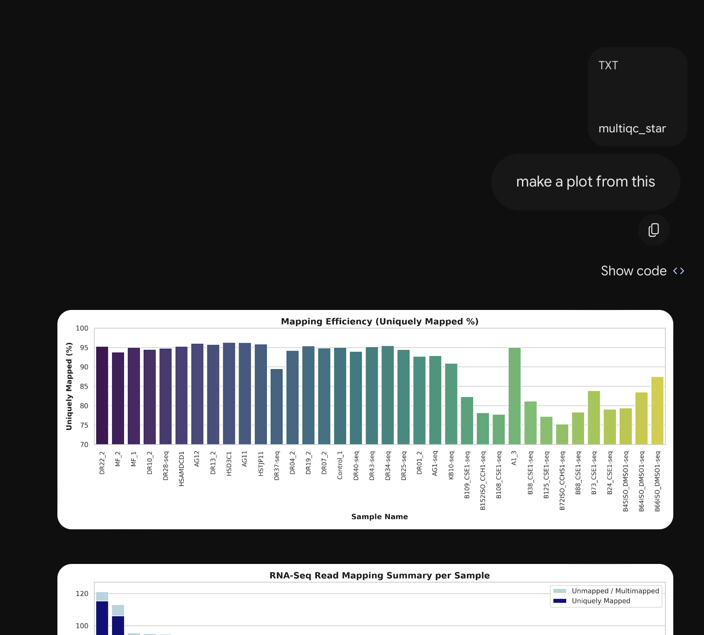

/Users/mcgaugheyd/git/Let_us_plot

# Goal

Take RNA-seq QC information and create some informative plots

# Import Data

```{r}
# first load libraries
library(tidyverse)

qc_data <- read_tsv("multiqc_star.txt")

qc_data
```

# Bar Plot

```{r}
qc_data |> 
  ggplot(aes(x=Sample,
             y=total_reads)) +
  geom_bar()
```

# Bar Plot That Works

```{r}
qc_data |> 
  ggplot(aes(x=Sample,
             y=total_reads)) +
  geom_bar(stat='identity') # <- tell geom_bar you have actual counts and just use it
```

# Fix Overlapping Text

Main problem: cannot read the labels on the x-axis

## Solution A

```{r}
qc_data |> 
  ggplot(aes(y=Sample,
             x=total_reads)) +
  geom_bar(stat='identity')
```

## Solution B

```{r}
qc_data |> 
  ggplot(aes(x=Sample,
             y=total_reads)) +
  geom_bar(stat='identity') +
  theme(axis.text.x = element_text(angle = 90))
```

# Refine Solution B

```{r}
qc_data |>
  ggplot(aes(x=fct_reorder(Sample, total_reads),
             y=total_reads)) +
  geom_bar(stat='identity') +
  theme(axis.text.x = element_text(angle = 90, hjust = 1, vjust = 0.5))
```

```{r}
qc_data |>
  ggplot(aes(x=fct_reorder(Sample, -total_reads),
             y=total_reads)) +
  geom_bar(stat='identity') +
  theme(axis.text.x = element_text(angle = 90, hjust = 1, vjust = 0.5))
```

```{r}
qc_data |>
  ggplot(aes(x=fct_reorder(Sample, -total_reads),
             y=total_reads)) +
  geom_bar(stat='identity') +
  theme(axis.text.x = element_text(angle = 90, hjust = 1, vjust = 0.5)) +
  theme_minimal()
```

```{r}
qc_data |>
  ggplot(aes(x=fct_reorder(Sample, -total_reads),
             y=total_reads)) +
  geom_bar(stat='identity') +
  theme_minimal() +
  theme(axis.text.x = element_text(angle = 90, hjust = 1, vjust = 0.5)) # this comes AFTER the theme_minimal!!!
```

```{r}
qc_data |>
  ggplot(aes(x=fct_reorder(Sample, -total_reads),
             y=total_reads)) +
  geom_bar(stat='identity') +
  theme_minimal() +
  theme(axis.text.x = element_text(angle = 90, hjust = 1, vjust = 0.5)) + # this comes AFTER the theme_minimal!!! 
  xlab("Sample") + ylab("Total Reads")
```

# Pile on more refinements
```{r}
qc_data |>
  mutate(m_reads = total_reads/1e6) |> 
  ggplot(aes(x=fct_reorder(Sample, -total_reads),
             y=m_reads)) +
  geom_bar(stat='identity', fill = 'gray70') +
  geom_text(aes(label = scales::comma(total_reads), y = 0), 
            angle = 90, 
            hjust = -0.1, 
            color = 'black') +
  theme_minimal() +
  theme(axis.text.x = element_text(angle = 90, 
                                   hjust = 1, 
                                   vjust = 0.5),
        axis.ticks.y =element_blank()) +
  xlab("Sample") + 
  ylab("Total Reads (millions)") 
```

```{r}
qc_data |>
  mutate(m_reads = total_reads/1e6) |> 
  ggplot(aes(x=fct_reorder(Sample, -total_reads),
             y=m_reads)) +
  geom_bar(stat='identity', fill = 'gray70') +
  geom_text(aes(label = scales::comma(total_reads), y = 0), 
            angle = 90, 
            hjust = -0.1, 
            color = 'black') +
  scale_y_continuous(expand = expansion(mult = c(0, 0.05))) + # Removes gap under the bars
  theme_minimal() +
  theme(axis.text.x = element_text(angle = 90, 
                                   hjust = 1, 
                                   vjust = 0.5), 
        axis.ticks.x = element_blank()) +
  xlab("Sample") + 
  ylab("Total Reads (millions)")
```


# Plot Another Metric
```{r}
qc_data |>
  ggplot(aes(x=fct_reorder(Sample, -uniquely_mapped_percent),
             y=uniquely_mapped_percent)) +
  geom_bar(stat='identity', fill = 'gray70') +
  geom_text(aes(label = uniquely_mapped_percent, y = 0), 
            angle = 90, 
            hjust = -0.1, 
            color = 'black') +
  scale_y_continuous(expand = expansion(mult = c(0, 0.05))) + # Removes gap under the bars
  theme_minimal() +
  theme(axis.text.x = element_text(angle = 90, 
                                   hjust = 1, 
                                   vjust = 0.5), 
        axis.ticks.x = element_blank()) +
  xlab("Sample") +  ylab("Percent Mapped") 
```

# Bonus Line up both plots
```{r, fig.height=8}
plotA <- qc_data |>
  mutate(m_reads = total_reads/1e6) |> 
  ggplot(aes(x=fct_reorder(Sample, -total_reads),
             y=m_reads)) +
  geom_bar(stat='identity', fill = 'gray70') +
  geom_text(aes(label = scales::comma(total_reads), y = 0), 
            angle = 90, 
            hjust = -0.1, 
            color = 'black') +
  scale_y_continuous(expand = expansion(mult = c(0, 0.05))) + # Removes gap under the bars
  theme_minimal() +
  theme(axis.text.x = element_blank(), ########## <- change!!!!!!!
        axis.ticks.x = element_blank()) +
  xlab("") + ########## <- change!!!!!!!
  ylab("Total Reads (millions)")

plotB <- qc_data |>
  ggplot(aes(x=fct_reorder(Sample, -total_reads), ############### <- change!!!!
             y=uniquely_mapped_percent)) +
  geom_bar(stat='identity', fill = 'gray70') +
  geom_text(aes(label = uniquely_mapped_percent, y = 0), 
            angle = 90, 
            hjust = -0.1, 
            color = 'black') +
  scale_y_continuous(expand = expansion(mult = c(0, 0.05))) + # Removes gap under the bars
  theme_minimal() +
  theme(axis.text.x = element_text(angle = 90, 
                                   hjust = 1, 
                                   vjust = 0.5), 
        axis.ticks.x = element_blank()) +
  xlab("Sample") +  ylab("Percent Mapped") 

cowplot::plot_grid(plotlist = list(plotA,plotB), ncol = 1)
```
# Can AI just do this for me?

Well, yes. Even with a fairly useless prompt.

Gemini.



Modest issue: It is written in python.

Solution, order it to write in R / ggplot2.

Major issue: It writes SO MUCH CODE.

(Partial) solution, order it to be concise.

